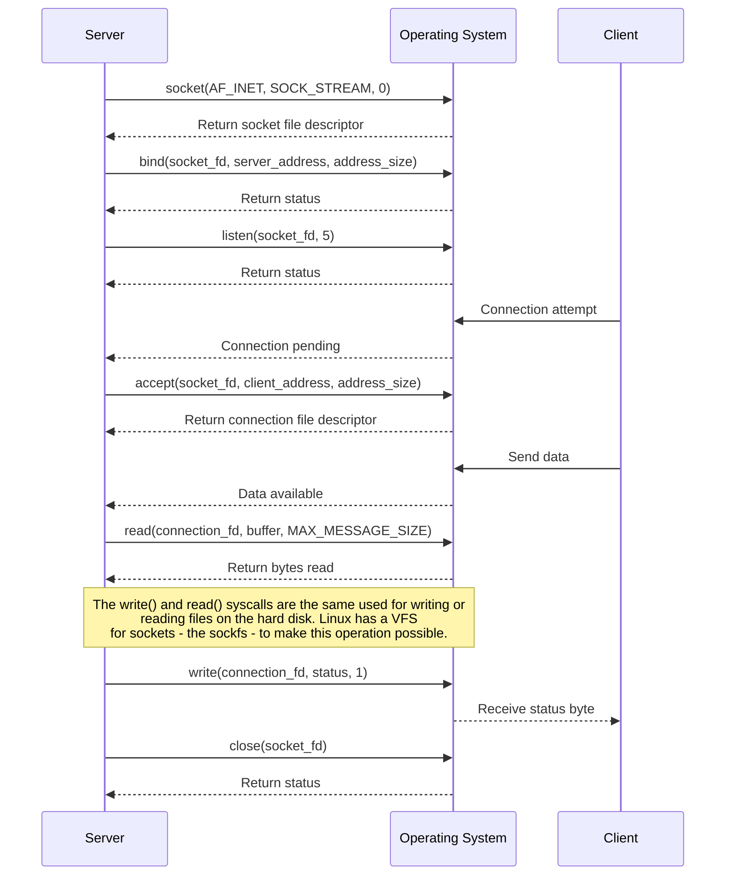

# Different ways to create a TCP server.

## 1 - Using blocking syscalls

```mermaid
sequenceDiagram
    participant Server
    participant OS as Operating System
    participant Client
    
    Server->>OS: socket(AF_INET, SOCK_STREAM, 0)
    OS-->>Server: Return socket file descriptor
    Server->>OS: bind(socket_fd, server_address, address_size)
    OS-->>Server: Return status
    Server->>OS: listen(socket_fd, 5)
    OS-->>Server: Return status
    
    Client->>OS: Connection attempt
    OS-->>Server: Connection pending
    Server->>OS: accept(socket_fd, client_address, address_size)
    OS-->>Server: Return connection file descriptor
    
    Client->>OS: Send data
    OS-->>Server: Data available
    Server->>OS: read(connection_fd, buffer, MAX_MESSAGE_SIZE)
    OS-->>Server: Return bytes read
    
    note over Server,OS: The write() and read() syscalls are the same used for writing or <br> reading files on the hard disk. Linux has a VFS <br> for sockets - the sockfs - to make this operation possible.
    Server->>OS: write(connection_fd, status, 1)
    OS-->>Client: Receive status byte
    
    Server->>OS: close(socket_fd)
    OS-->>Server: Return status
```

## 2 - Using epoll
TODO

## 3 - Using io-uring
TODO